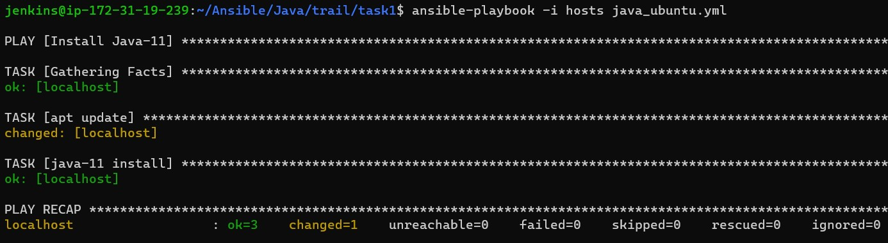
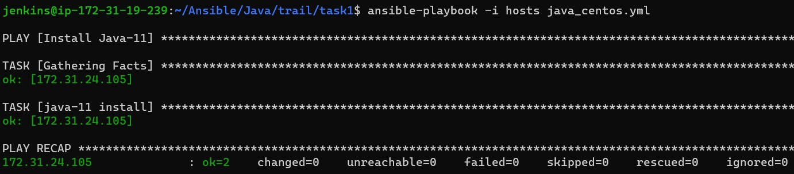
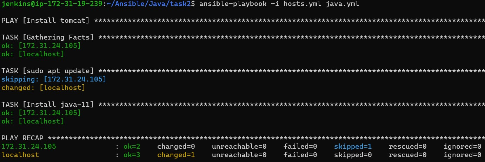
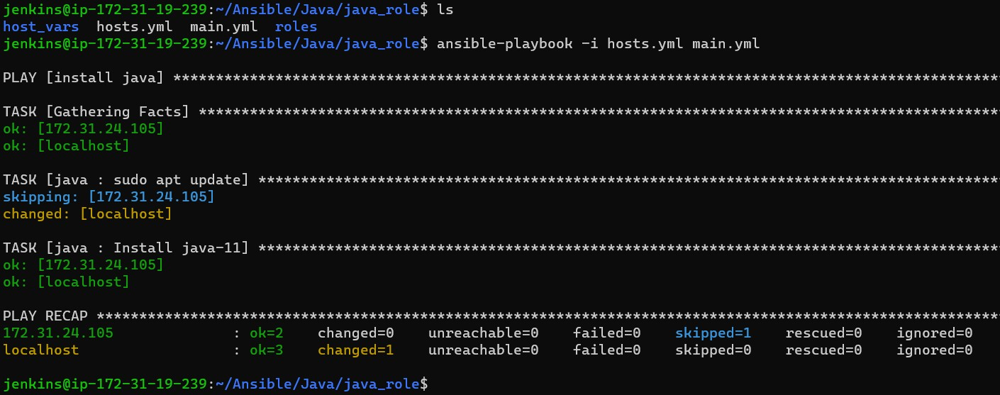

## Write a playbook for Java on ubuntu 22.04 and centos 7

### Ubuntu 22.04
* Java manual steps for ubuntu
```
sudo apt update
sudo apt install openjdk-11-jdk -y
```
* If manual steps are working properly write a playbook.
* For writing playbook for these steps.
* In this steps apt update & apt install openjdk-11-jdk is there for that apt module was used.
* Based on manual steps which module is suitable take that module.
* Java Ubuntu 22.04 ansible playbook 
```
---
- name: Install Java-11
  hosts: all
  become: yes
  tasks: 
    - name: apt update
      ansible.builtin.apt:
        update_cache: yes
    - name: java-11 install
      ansible.builtin.apt: 
        name: default-jre
        state: present
```


### Centos7
* Java manual steps for centos7 
```
sudo yum update -y
sudo yum install java-11-openjdk-devel
```
* If manual steps are working properly write a playbook.
* For writing playbook for these steps.
* In this steps yum update & yum install java-11-openjdk-devel is there for that apt module was used.
* Based on manual steps which module is suitable take that module.
* java centos7 ansible playbook
```
---
- name: Install Java-11
  hosts: all
  become: yes
  tasks: 
    - name: java-11 install
      ansible.builtin.yum: 
        name: java-11-openjdk-devel
        state: present
```

* After executing both playbook combine as one.
```
---
- name: Install tomcat
  hosts: all
  become: yes
  tasks: 
    - name: sudo apt update
      ansible.builtin.apt: 
        update_cache: yes
      when: ansible_facts['distribution'] == "Ubuntu"
    - name: Install java-11
      ansible.builtin.package:
        name: "{{Java_package}}"
        state: present   
```


* After complication this playbook making role.
* For making a role we skeleton of role structure.
* For skeleton of role we need ansible control node for creating role structure.
```
ansible-galaxy role init <role_name>
```
* For get in to our physical machine we need sftp command
```
sftp username@publicip
sftp> get -r <role_name>
```
* After getting in to physical machine you have to breaking a playbook into multiple files of roles folder.
* After breaking playbook we need to create a yaml file and hosts for running the role.
* After than this all things are push in to git repositories.
* After than git clone into ansible control node and run a role.
