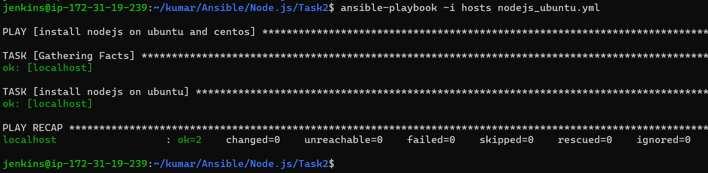
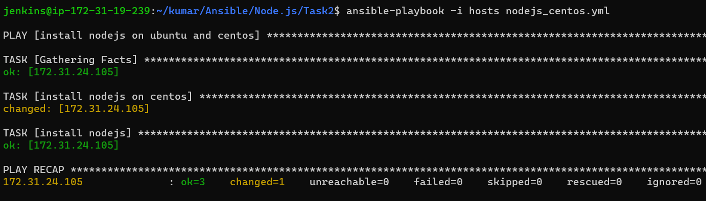
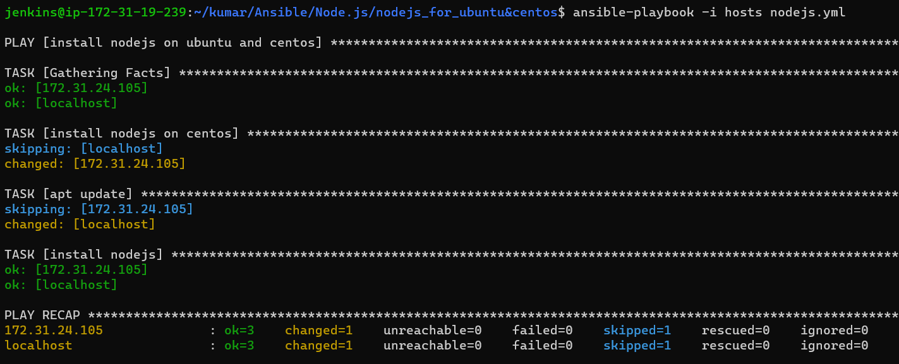
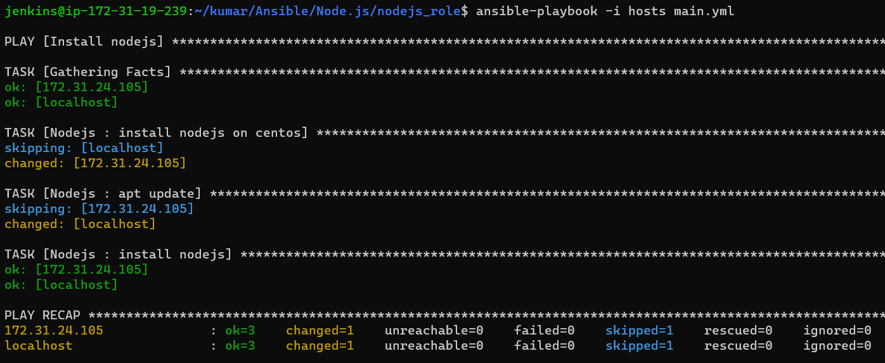

## Install Node.js and Ubuntu & Centos

### Ubuntu 22.04
* nodejs manual steps for ubuntu 22.04 [Refer Here](https://cloudcone.com/docs/article/how-to-install-node-js-on-ubuntu-22-04/)
```
sudo apt update
sudo apt install nodejs npm -y
node --version
```
* If manual steps are working properly write a playbook.
* For writing playbook for these steps.
* Based on manual steps which module is suitable take that module.
* nodejs ansible playbook for ubuntu 22.04
```
---
- name: install nodejs on ubuntu and centos
  hosts: all
  become: yes
  tasks: 
    - name: install nodejs on ubuntu
      ansible.builtin.apt:
        name: 
          - nodejs
          - npm
        update_cache: yes
        state: present
```

### Centos 7
* nodejs manual steps for centos 7 [Refer Here](https://phoenixnap.com/kb/install-node-js-npm-centos)
```
sudo yum update
curl –sL https://rpm.nodesource.com/setup_10.x | sudo bash -
sudo yum install –y nodejs
node --version
```
* If manual steps are working properly write a playbook.
* For writing playbook for these steps.
* Based on manual steps which module is suitable take that module.
* nodejs ansible playbook for centos 7
```
---
- name: install nodejs on ubuntu and centos
  hosts: all
  become: yes
  tasks: 
    - name: install nodejs on centos
      ansible.builtin.shell: curl –sL https://rpm.nodesource.com/setup_10.x | sudo bash -
    - name: install nodejs 
      ansible.builtin.yum:
        name: nodejs
        update_cache: yes
        state: present
```

* After complication this playbook making role.
```
---
- name: install nodejs on ubuntu and centos
  hosts: all
  become: yes
  tasks: 
    - name: install nodejs on centos
      ansible.builtin.shell: "curl –sL {{ nodejs_url }} | sudo bash -"
      when: ansible_facts['distribution'] == "CentOS"
    - name: apt update
      ansible.builtin.apt:
        update_cache: yes
      when: ansible_facts['distribution'] == "Ubuntu"
    - name: install nodejs
      ansible.builtin.package:
        name: "{{ nodejs_package }}"
        state: present
```

* For making a role we skeleton of role structure.
* For skeleton of role we need ansible control node for creating role structure.
```
ansible-galaxy role init <role_name>
```
* For get in to our physical machine we need sftp command
```
sftp username@publicip
sftp> get -r <role_name>
```
* After getting in to physical machine you have to breaking a playbook into multiple files of roles folder.
* After breaking playbook we need to create a yaml file and hosts for running the role.
* After than this all things are push in to git repositories.
* After than git clone into ansible control node and run a role.
